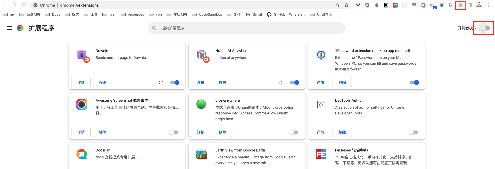
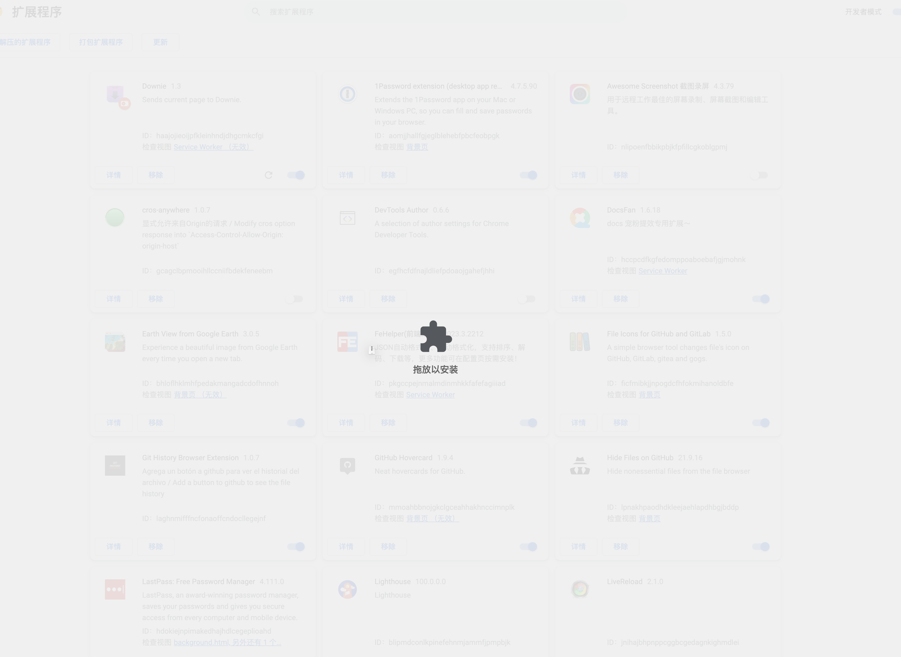
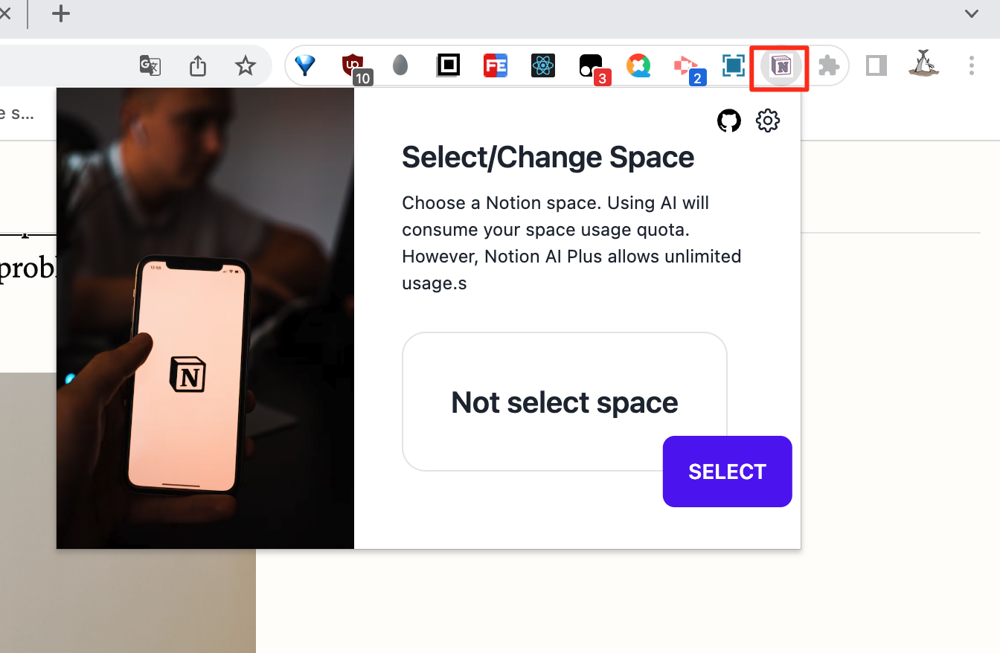
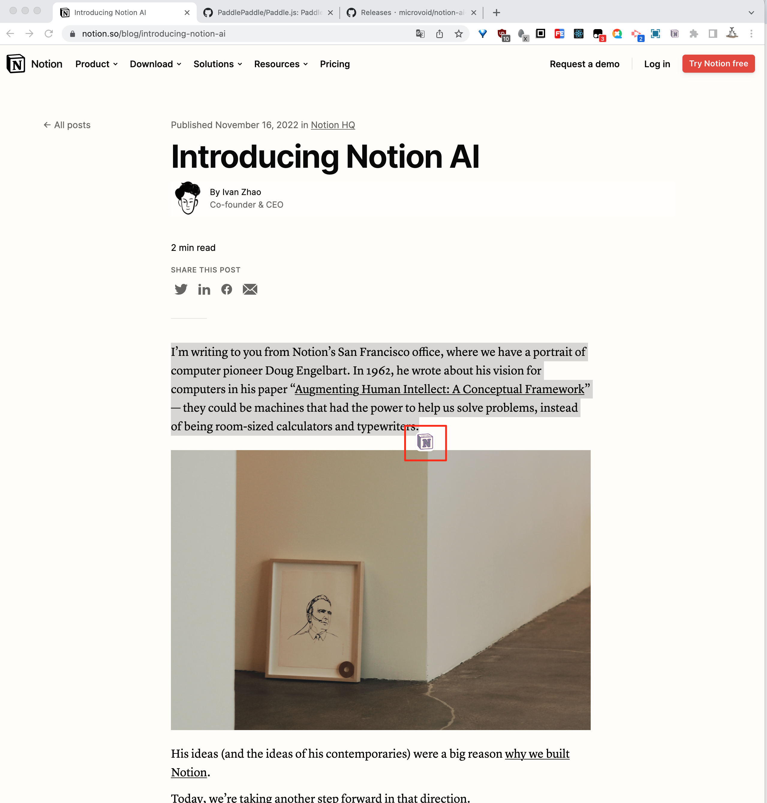
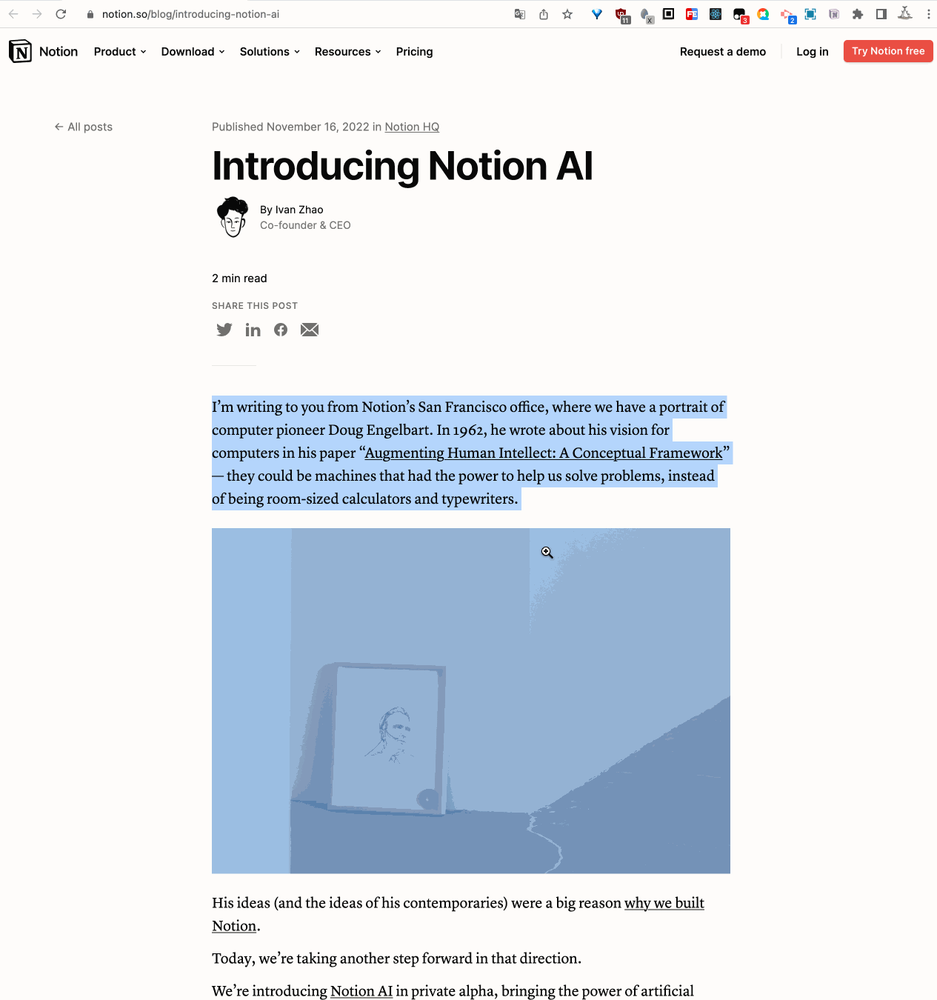
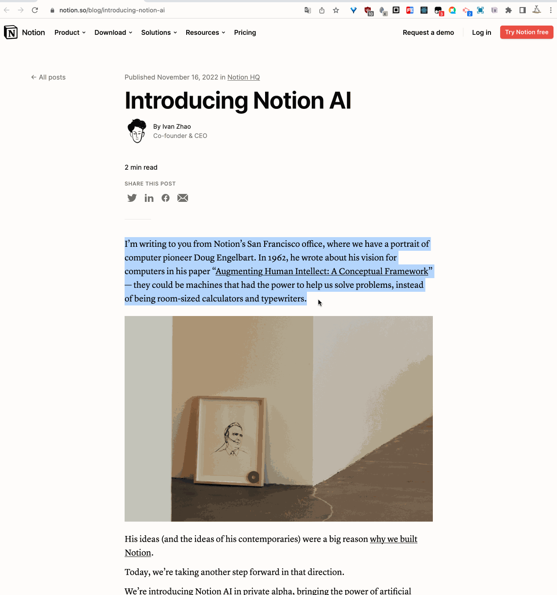

[中文文档](https://github.com/microvoid/notion-ai-anywhere/blob/main/README_cn.md)

# Notion AI Anywhere

[Notion AI Anywhere](https://github.com/microvoid/notion-ai-anywhere) It is a extension that allows you to use Notion AI capabilities while browsing any webpage.

## Overview

ChatGPT has become a mainstream term in 2023, and Notion has quickly launched its Notion AI capabilities. Although not perfect, it still impresses people. More users are willing to pay for AI to improve their work, writing, and recording efficiency. If you have upgraded to become a Notion AI Plus member, you can now use this extension to bring Notion AI capabilities to other websites

## Usage

1. Download the latest [release](https://github.com/microvoid/notion-ai-anywhere/releases) version zip package from here.
2. Open the Chrome Extensions page and enable the Developer mode.

3. Drag and drop the zip file into the plugin list.

4. Clicking on the extension will open a settings popup. If you are not logged in to Notion, you will be prompted to log in before opening the settings popup. Select a Notion workspace (it is recommended to select a workspace that has subscribed to Notion AI Plus, otherwise the usage will be limited).

5. Now, you can refresh any browser page and select a piece of content. There will be a button (which can be disabled in settings, and after disabling it, use cmd+k to open the AI pop-up) that can be clicked to use it normally.

6. You can set dark mode, switch languages, and disable the annoying selection icon (using cmd + k)

## Display Video

<video src="./assets/display.MOV" width="500px"></video>

# TODO

- [ ] ChatGPT3.5
- [ ] Adding OCR screenshot recognition capability (already in development)
- [ ] Identify all text content on the website and analyze it
- [ ] Support syncing generated content to Notion

## Contribution

Notion AI Anywhere is an open-source project and welcomes contributions from the community. Feel free to submit issues, feature requests, or pull requests on the GitHub [repository](https://github.com/microvoid/notion-ai-anywhere).
